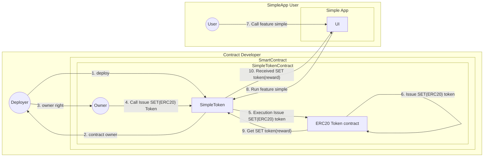

# simple-token

## Overview

- Simple ERC20 token contract
- Creating a basic application as part of my research efforts.

### Story Flow

1. The contract deployer launches the "SimpleToken" contract.
2. The contract deployer becomes the contract owner.
3. The contract deployer acquires contract owner rights.
4. The contract owner issues ERC20 tokens, namely "Simple ERC20 token" and "SET" token.
5. The SimpleToken contract, which is a token contract, executes the issuance of "Simple ERC20 token" and "SET" token through the Token contract.
6. The ERC20 token contract issues the "SET" token.
7. SimpleApp user calls the "simple" function from the UI.
8. From the UI, the SimpleToken contract executes the "simple" function.
9. The SimpleToken contract obtains the rewards for the "simple" function from the ERC20 token contract.
10. The SimpleApp user who called the "simple" function receives "SET" tokens as rewards from the SimpleToken contract.

### flow diagram

[simple token diagram](https://github.com/fuku-j/simple-token/blob/main/docs/simpe_token.pdf)

- mermaid.js

